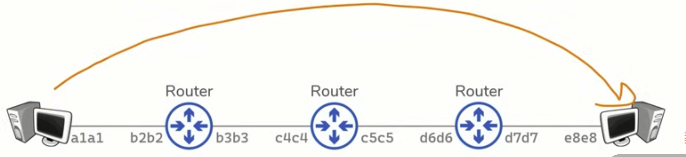
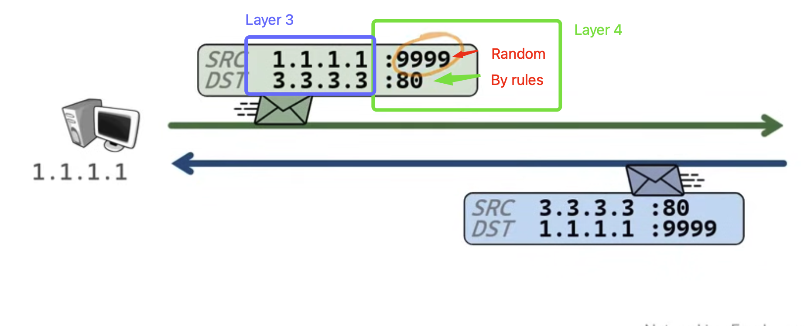
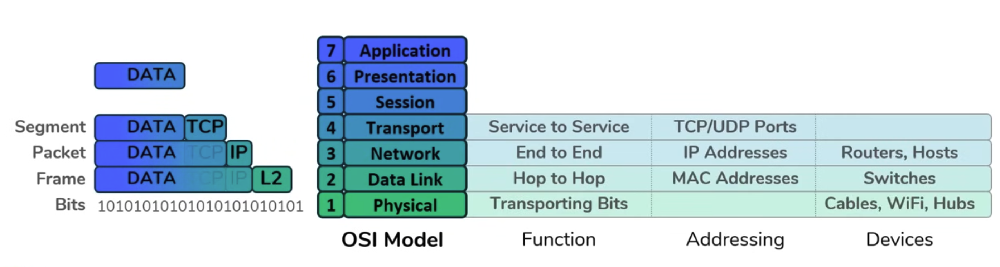

# OSI recap

## Here are some networking recaps. I’m trying to cover everything I need for ISS.

Now we have devices for networking.

### Devices

1. **Repeater:** Amplifies the signal (regenerates).
2. **Hub:** A multi-port repeater (broadcasting).
3. **Bridge:** Sits between hub-connected hosts.
   1. Only has two ports.
   2. Learns which hosts are on each side.
4. **Switches:** A combination of hubs and bridges. Facilitates communication **within** a network.
   1. Multiple ports.
   2. Learns which hosts are on each port. (How? By creating a **hierarchy** in networks and across the entire internet.)
5. **Router:** Facilitates communication **between** networks.
   1. Provides a traffic control point (security, filtering, redirecting).
   2. Routers have **routing tables**, which are used for all the networks a router knows about.

  
_Hierarchy of routers_

> **Note:** We have two terms: **switching** and **routing**. Switching means moving data within a network, and routing means moving data between networks. Why mention this? Because other devices use these methods too—it’s not mandatory to have only routers and switches (even virtual ones).

### OSI model

Two hosts share data over a network. Most hosts follow some rules.  
Each layer provides and has a specific purpose.

### Layer 1 (Physical Layer) — Transporting Bits

Examples include fiber and Wi‑Fi. A repeater is a Layer 1 device.

### Layer 2 (Data Link Layer) — Hop‑to‑Hop Delivery

#### Devices

- **NICs** (network interface cards or Wi‑Fi adapters)
- **Switches**

This layer puts bits on the wire and receives bits from the wire. Anything connected to the wire is a Layer 2 device (e.g., NIC, Wi‑Fi card).

Layer 2 uses MAC addresses for hop‑to‑hop delivery.

  
_Hop‑to‑Hop delivery_

**Question:** Once we understand hop‑to‑hop delivery, who ensures that our packet reaches its destination?

### Layer 3 (Network Layer) — End‑to‑End Delivery

Delivery happens using IP addresses (with routers).

#### Devices

- Routers
- Hosts
- Anything with an IP address

**Question:** Why do we need MAC addresses when we have IP addresses?

When we want to send data, we send a binary packet to the target and add a header that contains the IP addresses of the source and destination for Layer 3, and the MAC addresses of the source and the gateway router for Layer 2.  
When the packet reaches its destination, the header changes. For example, when the packet reaches a router, the header is updated with new source and destination MAC addresses.

> **Note:** ARP (Address Resolution Protocol) links Layer 3 addresses to Layer 2 addresses.

### Layer 4 Transport - Service to service delivery

1. Distinguish data steams
2. This Layers uses ports for addressing

   

### Layer 5, 6 and 7

Here we can say we have one Layer (like TCP/IP model).

## Encapsulation and De-encapsulation

Each Layer adds its data which useful for its work. From the application layer to physical layer

1. Segment - Adding TCP/PORT
2. Packet - Adding IP addresses
3. Frame - Adding MAC addresses
4. Binary stream

## 

