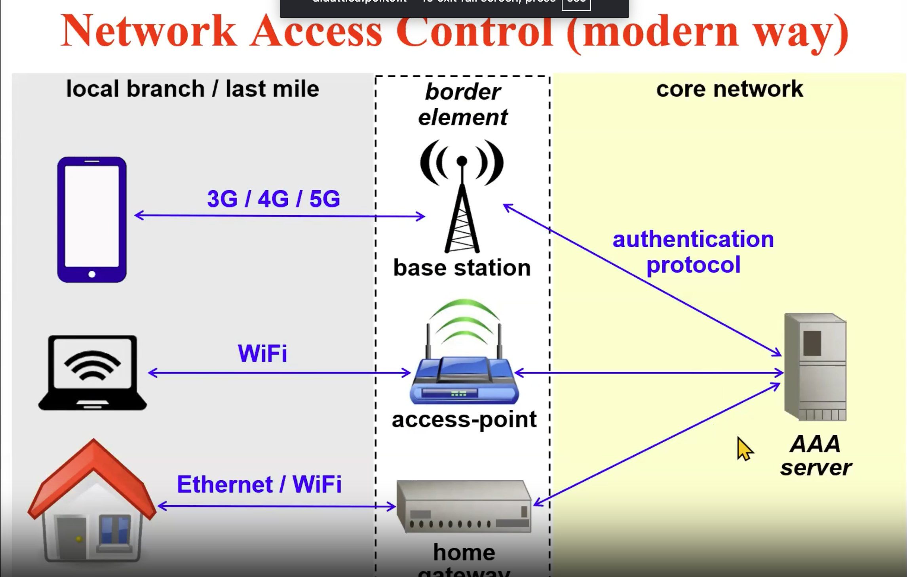

# Security of IP networks - net sec

## Network access control

**Q -** What is network access control?

> deciding who has right to join certain network. In the past days we used NAS (Network access Server in Dial-up lines)

We have network access control concept in modern days too. We have a border element which connects us to the core network and the core network (AAA server for example) checks our authentication.

**Q -** why we use network access control??

> Because it is vital to check an user has privilege to accessing a network and all users must authenticated and authorized for access to the core network.

## Authentication of PPP channels

**Q -** What does PPP do?

> PPP is able to encapsulate network packets (L3, e.g. IP) and carry them over a point to point link.
> some examples of that:
>
> 1. Physical
> 2. virtual L2 (e.g. xDSL with PPPoE)
> 3. virtual L3 (e.g. L2TP over UDP/IP)
